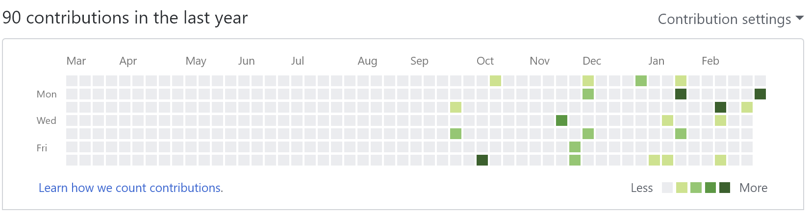
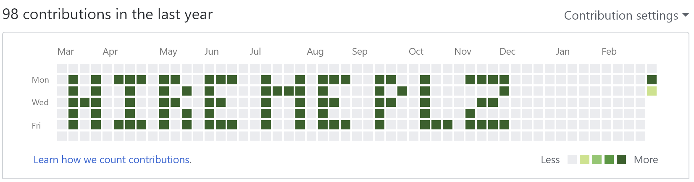

# GithubCommitHistoryFaker
Generate your own stupid messages in your github commit history.

Fool your friends into thinking you meticulously committed to your github repositories only on certain days for over a year just for a dumb joke!

**Note: Does not permanently change your commit history, this just changes the fill of the squares in the svg commit graph.**

**To install, either add the text of bookmarklet.js to a new bookmark, or copy and paste the source code file into the console.**

Turns this: 

Into this: 
